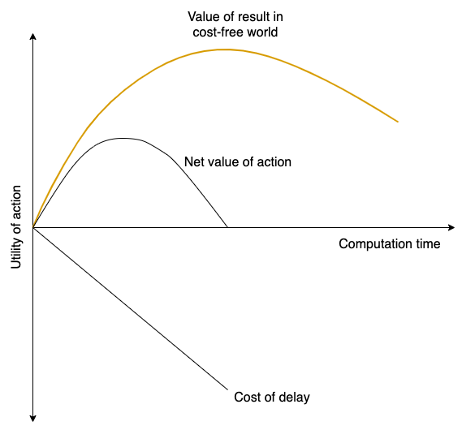

# Report

## Connect the Dots

### Rationality & Loneliness & Pain

### Computational Rationality
* What if the value of result in cost-free world decreases along with the computation time?
* History is the best computation time?

	

### Inhumane vs Human

	
	

## References