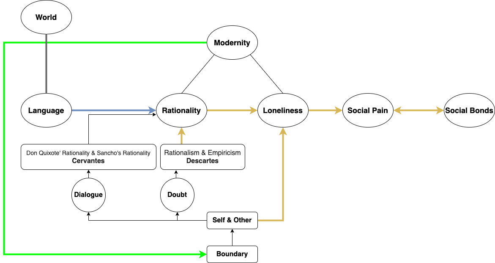
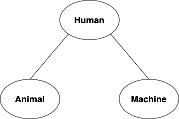

# Report

## Connect the Dots

### Rationality & Loneliness & Pain

### Computational Rationality
* What if the value of result in cost-free world decreases along with the computation time?
* History is the best computation time?

	

### Inhumane vs Human

	
	

## Zoom In
* When starts the consciousness of Self and Other?
* How does the concept of Self and Other develop to Modernity?
* Is Self and Other immanent in Humans only or in Animals also?
* Key of Loneliness: Self and Other?
* Factors of Loneliness: Segregation, Evaluation, Loss of Love, Rationality without Dialog, etc...
* Rationalism of Descartes is the base of Modernity, which leads to Loneliness?

## References
